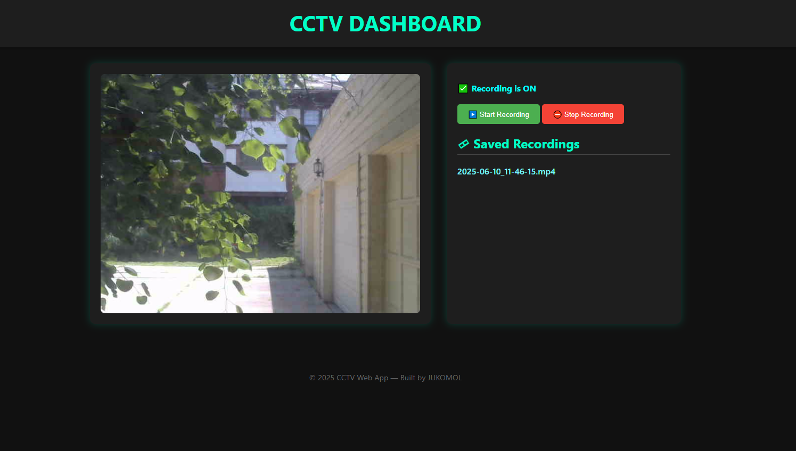

# 📹 Webcam CCTV Recorder

A lightweight Python web application built with Flask that turns your webcam into a basic CCTV system. Stream the live camera feed in your browser, record footage hourly, browse saved videos, and start/stop recording from the interface.

---

## 🔧 Features

- 🔴 **Live Webcam Feed** via browser
- 📁 **Automatic Hourly Recording** (MP4 format)
- ▶️ **Start/Stop Recording** from UI
- 📂 **Explore & Download Recordings** from a simple file browser
- 🧵 Thread-safe capture and recording using locks and threading
- 🐳 **Docker Support** for easy deployment
- 💻 **Windows Compatible** (uses `cv2.CAP_DSHOW`)

---

## 🖥️ Interface Preview

- **Left panel:** Live camera feed
- **Right panel:** Saved recordings (downloadable)
- **Top:** Recording status and control buttons



---

## 🚀 Getting Started

### 📦 Installation

1. Clone the repo:

   ```bash
   git clone https://github.com/yourusername/webcam-cctv-recorder.git
   cd webcam-cctv-recorder
   ```

2. Install dependencies:

   ```bash
   pip install flask opencv-python
   ```

### ▶️ Run the App

```bash
python app.py
```

Visit: [http://localhost:5000](http://localhost:5000)

---

## 🐳 Docker Deployment

### Build the Image

```bash
docker build -t webcam-cctv .
```

### Run the Container

On **Linux**:

```bash
docker run -p 5000:5000 --device=/dev/video0 webcam-cctv
```

On **Windows** (Hyper-V / WSL2 only):

> Pass USB webcam through WSL2 or use `--mount` with host integration.

---

## 📂 Directory Structure

```
webcam-cctv-recorder/
│
├── app.py                   # Main Flask app
├── templates/
│   └── index.html           # Web interface
├── static/
│   └── recordings/          # Saved .mp4 videos
├── Dockerfile               # For containerization
└── README.md                # You're here!
```

---

## 📃 License

MIT License © 2025 [Jahir Uddin]
